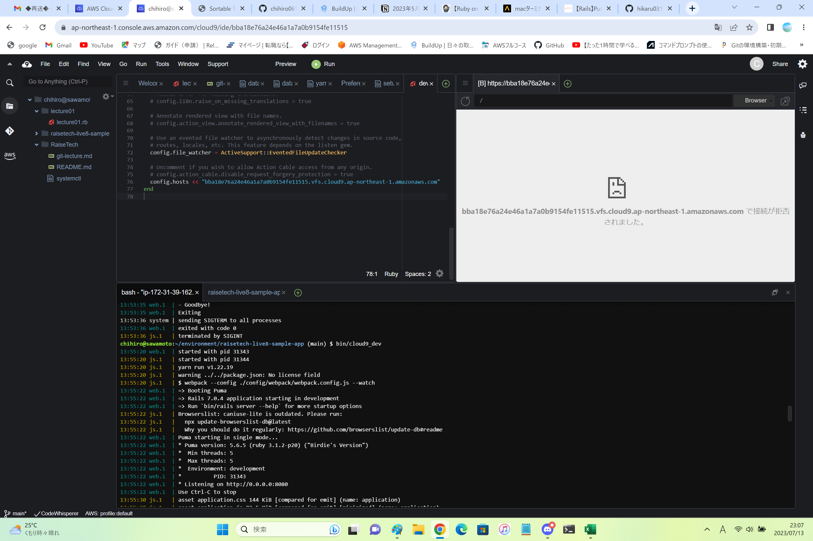
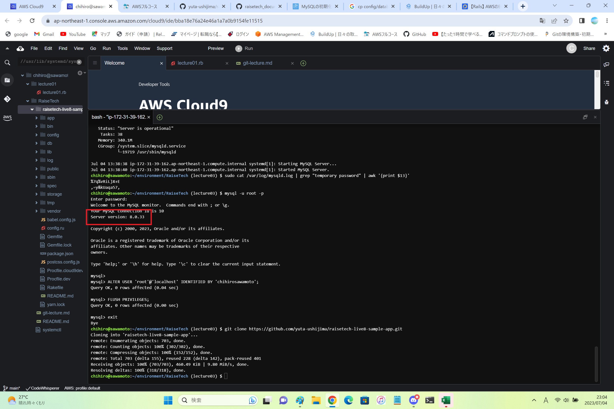
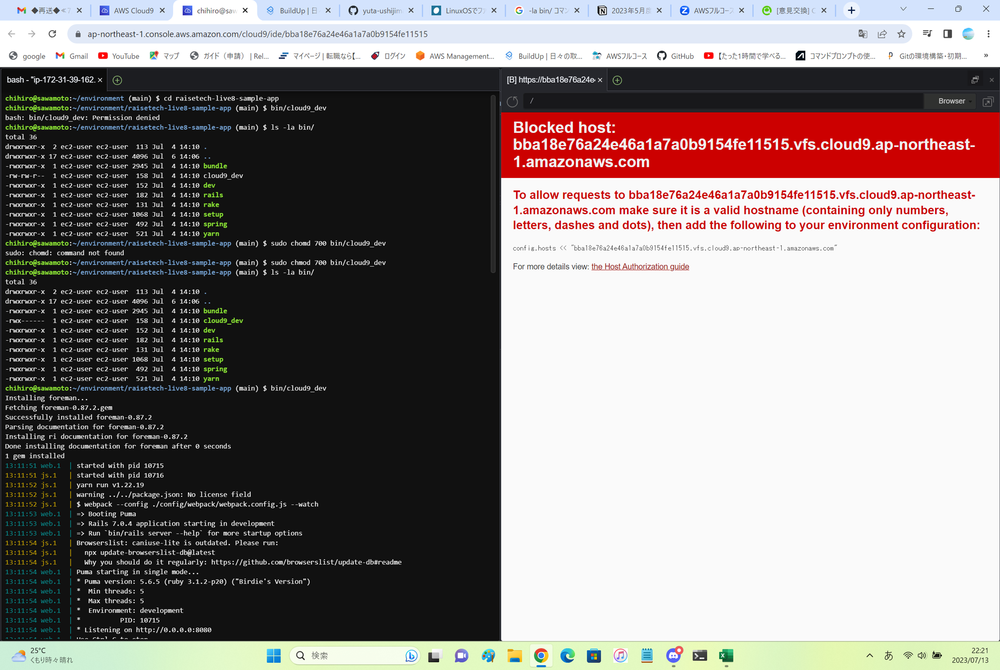
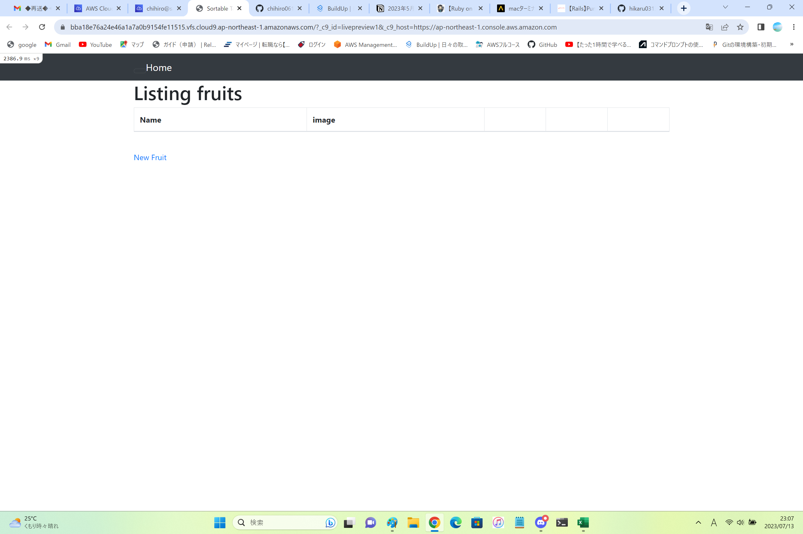

# 第３回課題
 ## Ruby on RailsによるWebアプリケーションの起動
---
## 学んだこと
  - どれがアプリでファイル、データベースなのかを理解するのが大変だった
  - Cloud9 のストレージ容量増加
  - データベースを管理するMySqlをインストール
  - RubyとGemのバージョンを合わせる（Gemfileはアプリなのでバージョンはいじることはできない）
  - Ruby on Railsがデータベースに接続するためのファイルがdatabase.yml
  - MySqlのセットアップ
  - MySQLに接続するためにはソケットが必要
  - アプリをデプロイ（アプリを公開用のサーバに乗せて一般に公開すること）
---
## 課題
  - AP サーバーの名前とバージョンを確認：Puma version5.6.5
  - アプリケーションサーバーを終了させた場合アクセスできるか：できない
    - 
  - Cloud9 で動作 しているバージョンはいくつか
    - 
  - DBサーバーを終了させた場合アクセスできるか：できない
    - 
  - Rails の構成管理ツール：bundler
  - アプリケーションの起動
    - 