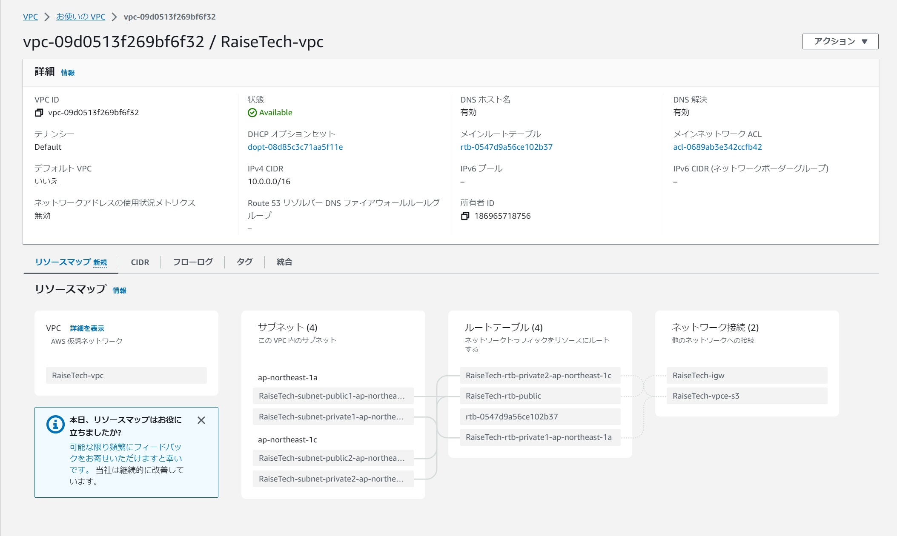
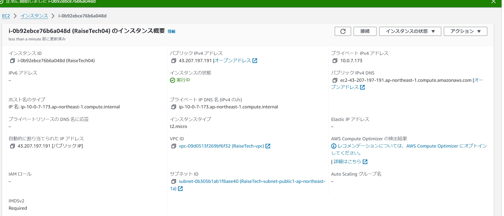
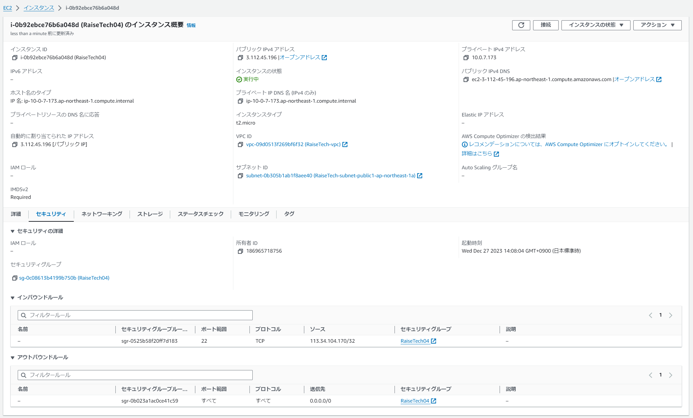
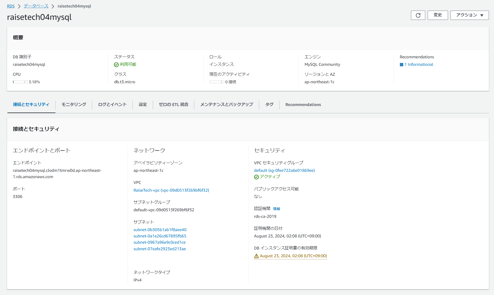
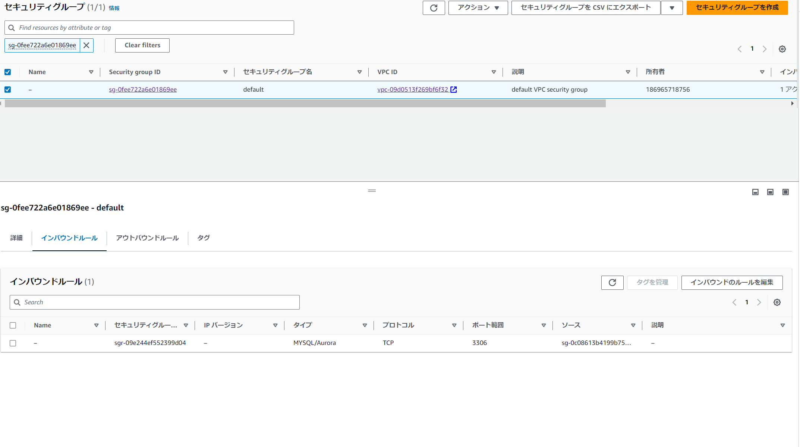
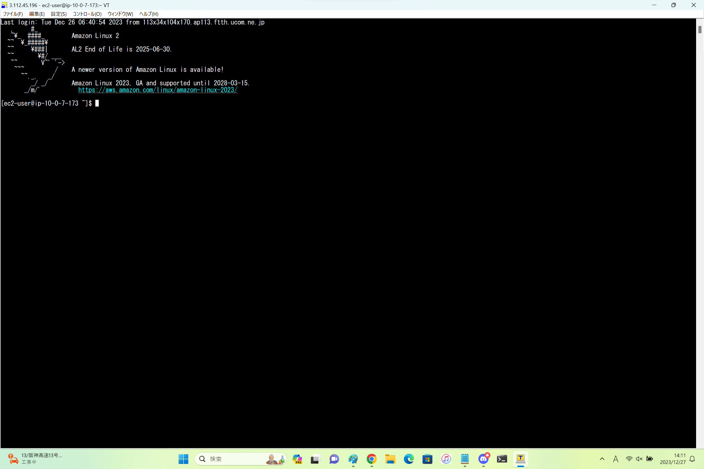
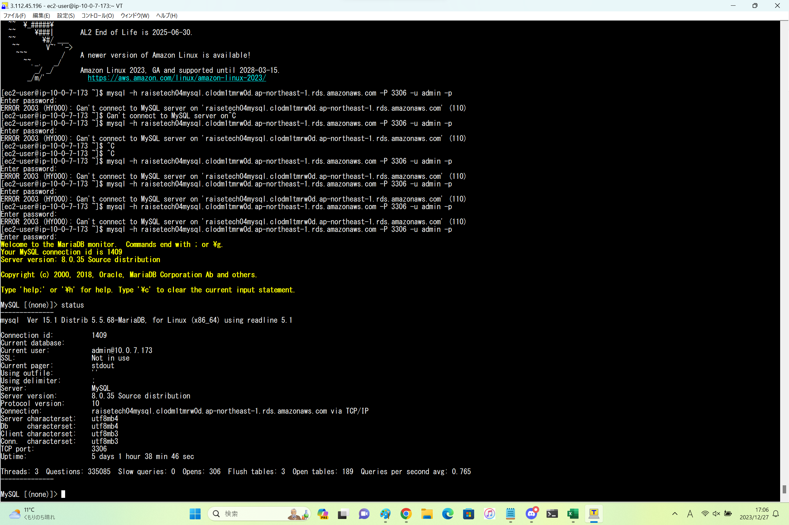

### 第４回課題

### VPC
### 

### EC2
### 
##  EC2セキュリティグループ
## 

### RDS
### 
##  RDSセキュリティグループ
## 

### ローカルPCからEC2インスタンスへSSH接続
### 

### EC2からRDSのMySQLへ接続
### 
 

- EC2からRDSへ接続するという理解が難しかったが、図に書くとイメージができるようになった。
- ローカルPCを使ってEC2→RDSをするには、ローカルPC→EC2への接続が必要（SSH接続、TeraTerm使用）
- EC2→RDSについて、接続ができずERROR 2003 (HY000): Can't connect to MySQL server on 'エンドポイント' (110)のエラー
   EC2セキュリティグループのインバウンドルールが間違っていた。
   インバウンドルールで選択するセキュリティグループが4回課題用に作成したセキュリティグループではなくデフォルトのものになっていたのが原因
- 設定について見比べて都度確認していかなければならない